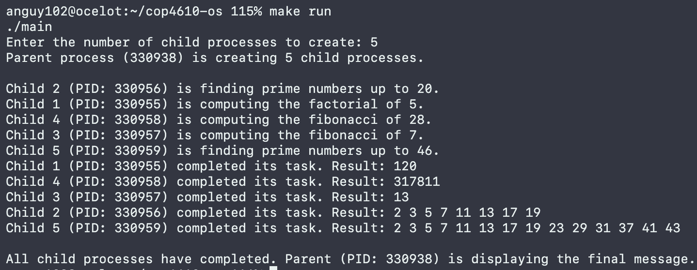

# ASSIGNMENT 1 REPORT

**Aaron Nguyen**  
PID: 6403474

## Design Choices

- **Input Validation**: The program includes input validation for the number of child processes to be created.
- **Modularized Tasks**: Each child process is assigned a specific computational task based on its index. This approach simplifies the management and tracking of different tasks.
- **Process Synchronization**: The parent process waits for all child processes to complete their tasks using `waitpid`, ensuring that the parent only proceeds once all children have finished.
- **Simulating Computationally Intensive Tasks**: Using `sleep` to simulate time-consuming tasks in child processes was an effective method for testing process synchronization in a controlled environment without the need for actual computation.

## Lessons Learned

- **Error Handling**: Proper error handling is critical in multi-process programs as they are difficult to debug, and we need to gracefully handle failures such as unsuccessful fork operations, dynamic memory allocation, or `waitpid()` errors.
- **Resource Management**: Managing resources, such as dynamically allocated memory, is crucial to prevent memory leaks, especially in applications that spawn multiple processes.
- **Process Control Flow**: Understanding how to control processes, including creating child processes with `fork`, waiting for them to complete with `waitpid`, and using exit statuses to communicate the outcomes of child tasks, is important.

## Challenges Encountered

- **Synchronization of Parent and Child Processes**: Ensuring the parent process accurately waits for each forked child process was essential, considering their tasks and execution times. The program needed to effectively manage the completion of child processes without causing the parent process to prematurely proceed or unnecessarily wait.
- **Error Handling in Child Processes**: It was crucial to handle errors such as allocation or `waitpid` failure properly to ensure that child processes exit gracefully in case of errors avoiding zombie processes.

## Addressing Challenges

- **Process Control and Synchronization**: By using `waitpid` with the PID of each child, the parent process effectively waits for each child process to complete. This not only synchronizes the parent and child processes but also allows the parent to handle each child's termination individually, including checking for abnormal termination.
- **Robust Error Handling**: The program includes checks after each critical operation, such as `fork`, dynamic memory allocation, and `waitpid`. Upon encountering an error, appropriate error messages are displayed using `perror`, and the program exits or continues safely, depending on the context.
