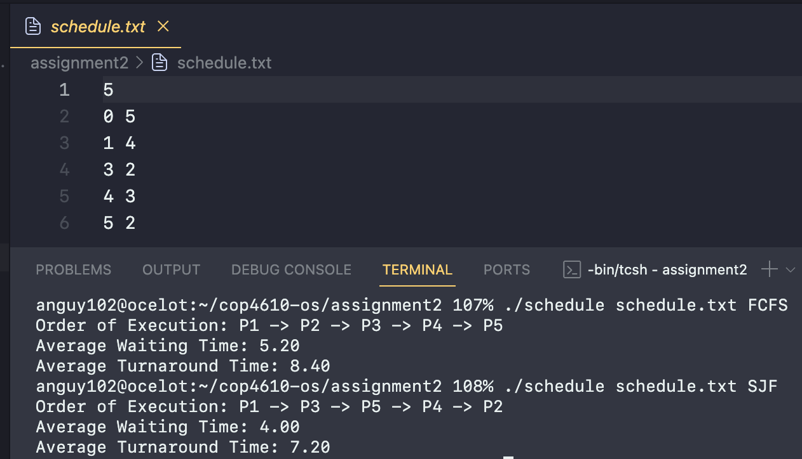

# ASSIGNMENT 2

**Aaron Nguyen**  
PID: 6403474

## Design Choices

- **Separate functions**: Utilizing distinct functions for FCFS and SJF enhances code organization, readability, and maintainability, enabling focused implementation and debugging.

- **Queueing principle for FCFS**: FCFS adheres to a queueing principle, executing processes in arrival order. Utilizing a prefix sum algorithm efficiently calculates waiting and turnaround times.

- **Greedy approach for SJF**: SJF employs a greedy strategy, selecting the process with the shortest burst time at each decision point to minimize the time for the next shortest job to execute.

- **In-place swapping for SJF**: In SJF, in-place swapping dynamically reorders processes based on burst times, optimizing memory usage and computational efficiency while ensuring process identification consistency.

## Challenges Encountered

- **Accurate time calculation**: Precision in calculating waiting and turnaround times, especially for SJF, poses challenges due to dynamic process selection, requiring meticulous tracking of `current_time` and adjustments based on process arrival times.

- **Maintaining execution order for SJF**: Preserving execution order while selecting processes based on burst time presents challenges, necessitating careful selection of the index to swap within arrays.

## Addressing Challenges

- **Accurate time calculation**: Tracking `current_time` and adjusting it based on process arrival times ensures precise calculation of waiting and turnaround times.

- **Maintaining execution order for SJF**: Overcoming challenges involves carefully selecting the index to swap within arrays, ensuring accurate scheduling based on burst times.

## Lessons Learned

- **Modular design**: Separate functions streamline implementation and debugging, enhancing code organization and maintainability.

- **Precision in time calculation**: Achieving accuracy in time calculations demands meticulous tracking of variables and adjustments based on process characteristics, particularly in dynamic scheduling algorithms like SJF.

- **Efficient data manipulation**: In-place swapping optimizes memory usage and computational efficiency in SJF, underscoring the importance of efficient data manipulation techniques.

- **Manual verification of results**: Testing and manually verifying results provide essential validation, ensuring the correctness and reliability of simulation outcomes.
