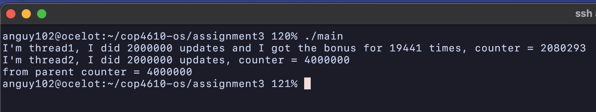

# ASSIGNMENT 3 REPORT

**Aaron Nguyen**

640347



### Task 1
Done.

### Task 2
1. Section annotations:
```c
void *thread1() {
  int bonus_ok = 0;
  int bonus_times = 0;
  int updates = 0;

  // Remainder section
  while (updates < MAX_UPDATES) {
    // Entry section
    if (pthread_mutex_lock(&mutex) == 0) {
      // Critical section
      bonus_ok = MAX_UPDATES - updates >= 100 && counter->value % 100 == 0;
      if (bonus_ok) {
        counter->value += 100;
      } else {
        counter->value += 1;
      }
      // Exit section
      pthread_mutex_unlock(&mutex);
    }

    // Remainder section
    if (bonus_ok) {
      bonus_times += 1;
      updates += 100;
    } else
      updates += 1;
  }

  // Remainder section
  printf("I'm thread1, I did %d updates and I got the bonus for %d times, "
         "counter = %d\n",
         updates, bonus_times, counter->value);

  return NULL;
}
```

```c
void *thread2() {
  int updates = 0;

  // Remainder section
  while (updates < MAX_UPDATES) {
    // Entry section
    if (pthread_mutex_lock(&mutex) == 0) {
      // Critical section
      counter->value += 1;
      // Exit section
      pthread_mutex_unlock(&mutex);
    }
    // Remainder section
    updates += 1;
  }

  // Remainder section
  printf("I'm thread2, I did %d updates, counter = %d\n", updates,
         counter->value);

  return NULL;
}
```

2. Critical section problem analysis:
- **Mutual Exclusion**: Met, through the use of `pthread_mutex_lock(&mutex)` and `pthread_mutex_unlock(&mutex)`. When a thread enters the critical section to modify `counter->value`, the mutex ensures that no other thread can simultaneously access the critical section.
- **Progress**: Met, the implementation guarantees progress because when the mutex is available, any thread attempting to enter the critical section can do so. Threads are not indefinitely blocked outside the critical section as long as they seek to acquire the lock once it's released.
- **Bounded Waiting**: Met, benefiting from the operating system's (Linux, in this case) effort to manage threads fairly. This includes mechanisms that indirectly support the bounded waiting condition. Linux scheduling and pthreads ensure fairness and prevent starvation.
