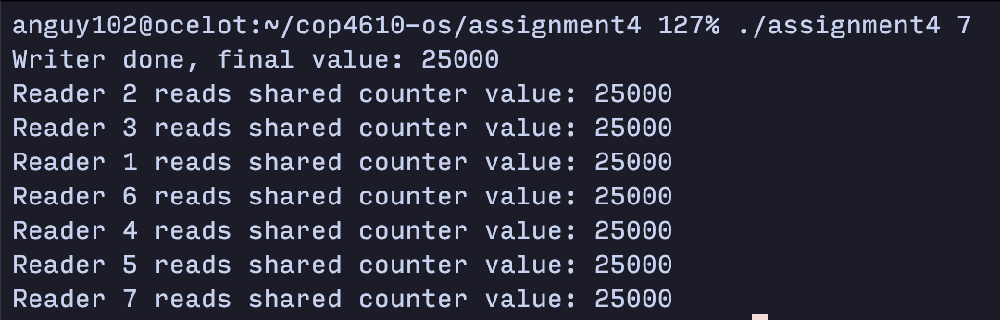

# ASSIGNMENT 4 REPORT

**Aaron Nguyen**

640347

My solution implements a readers-writer lock with an emphasis on fairness between readers and writers, while aiming to prevent starvation and deadlock:

### Starvation-Free
Starvation occurs when a thread is perpetually denied access to a shared resource. This implementation mitigates starvation through several key mechanisms:

- **Order Semaphore (`order_mutex`):** This semaphore plays a crucial role in ensuring that access to the shared resource is granted in the order of request arrival. By making both readers and writers wait on this semaphore before attempting to acquire their locks, the solution ensures that no thread can jump the queue, by that preventing the starvation of both readers and writers.

- **Reader Count Check:** The mechanism of incrementing a readers' count when a reader begins and decrementing it when a reader finishes, combined with the conditional access to the `access_mutex` semaphore (only the first reader waits on it and the last reader signals it), ensures that readers can efficiently share the resource among themselves without causing writer starvation. Since writers will eventually gain access after the last reader signals the `access_mutex`, this ensures fairness and prevents writer starvation.

### Deadlock-Free
Deadlock is a situation where a set of processes are blocked because each process is holding a resource and waiting for another resource acquired by some other process. This implementation avoids deadlock by:

- **Orderly Access:** The `order_mutex` ensures that threads access shared resources in order, preventing scenarios where two threads might indefinitely wait on each other to release resources.

- **Structured Resource Acquisition and Release:** The clear and strict sequence of acquiring and releasing semaphores (e.g., `order_mutex`, `readers_mutex`, and `access_mutex`) avoids circular wait conditions, by that preventing deadlock.

### Fairness
Fairness is ensured by giving equal opportunity to both readers and writers to access the shared resource:

- **Equal Opportunity Through `order_mutex`:** By queuing both readers and writers through the same `order_mutex`, the solution ensures that neither readers nor writers are favored. This prevents a situation where a continuous stream of arriving readers could indefinitely block writers, and vice versa.

- **Balanced Access for Readers and Writers:** While multiple readers can concurrently read, ensuring efficiency and fairness among readers, writers are provided with a fair chance to write as the `order_mutex` and `access_mutex` combination prevents a new reader from starting if a writer is waiting.
