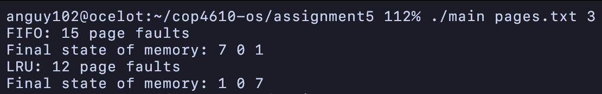

# ASSIGNMENT 5 REPORT

**Aaron Nguyen**

640347

## Design Choices:
- Page check and index function: Initially, separate functions assessed whether a page was in memory and retrieved its index. Refactoring to combine these into a single function reduced redundancy and enhanced performance, emphasizing the importance of minimizing unnecessary memory traversal.
- Static arrays: Opting for static arrays to represent memory frames and track access times balanced simplicity with performance. This choice facilitated straightforward implementation while simulating the complex behavior of page replacement algorithms.
- Algorithm implementation: Implementing the FIFO and LRU algorithms directly, without abstracting into classes or more complex data structures, kept the focus on the core logic, making the algorithms more transparent and easier to understand.

## Lessons Learned:
- Algorithm efficiency and complexity: The contrast between FIFO's straightforward implementation and LRU's more complex requirements for tracking access times underscored the trade-offs between algorithm simplicity and real-word usage.
- Data structure complexity: The project reinforced that the choice of data structures can significantly impact the ease of implementation and performance. Static arrays were sufficient for this simulation but highlighted the potential need for more dynamic data structures in more complex scenarios.
- Refactoring for clarity and efficiency: Combining functions for improved efficiency demonstrated the value of continuous refactoring in software development. It highlighted how minor adjustments could lead to more readable and efficient code.

## Challenges and Solutions:
- Memory management: Simulating memory frames and managing page replacements within the constraints of static arrays posed challenges in accurately tracking page faults and access times, especially for LRU. This was addressed by managing indices and access time arrays, ensuring that the simulation remained true to the expected behavior of each algorithm.
- Algorithm accuracy vs. performance: Balancing the accuracy of the LRU implementation with performance considerations necessitated a thoughtful approach to tracking access times.
